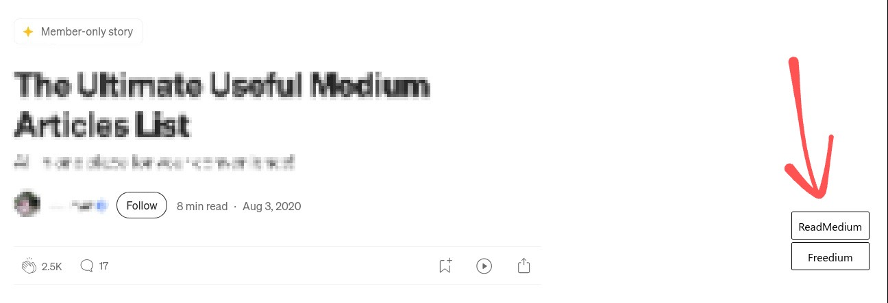

# Medium Unlocked

> A userscript that adds alternate reading links (ReadMedium & Freedium) for paywalled Medium articles.

## Table of Contents

* [Overview](#overview)
* [Features](#features)
* [Usage](#usage)
* [Notes](#notes)
* [Contributing](#contributing)

## Overview

**Medium Unlocked** is a lightweight userscript that detects paywalled ("member-only") articles on Medium and provides alternate reading links using external services — [ReadMedium](https://readmedium.com) and [Freedium](https://freedium.cfd).

## Features

* Detects Medium paywalls automatically
* Works on both mobile and desktop
* Adds ReadMedium & Freedium buttons
* Simple, fast, and privacy-respecting
* Supports Medium's dynamic page loads (SPA)

## Usage

1. Install a userscript manager: [Tampermonkey](https://www.tampermonkey.net/) or [Violentmonkey](https://violentmonkey.github.io/)
2. [Install the script](https://github.com/ShrekBytes/medium-unlocked/raw/main/medium-unlocked.user.js)
3. Visit Medium and enjoy alternate reading links.

## Notes

* This script **does not bypass** paywalls directly
* It only links to third-party services
* Use at your own discretion

## Contributing

Found a bug or have a feature request?
[Open an issue](https://github.com/ShrekBytes/medium-unlocked/issues) or submit a pull request.
