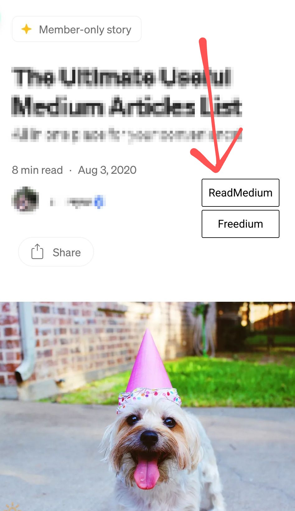

# Medium Unlocked

> A userscript that adds alternate reading links (ReadMedium & Freedium) for paywalled Medium articles.

## Table of Contents

* [Overview](#overview)
* [Supported Domains](#supported-domains)
* [Usage](#usage)
* [Features](#features)
* [Notes](#notes)
* [Contributing](#contributing)

## Overview

**Medium Unlocked** is a lightweight userscript that detects paywalled ("member-only") articles on Medium and provides alternate reading links using external services — [ReadMedium](https://readmedium.com) and [Freedium](https://freedium.cfd).

## Supported Domains
> This script supports all Medium domains, subdomains, and some custom domains. While it’s technically possible to match every site with `*://*/*`, doing so would run the script on all websites, which is inefficient and unnecessary. If you want a Medium-powered custom domain added, [open an issue](../../issues) and I’ll add it.

### ReadMedium

- Medium domains (`medium.com`)
- Medium subdomains (`*.medium.com`)

### Freedium

- Medium domains (`medium.com`)
- Medium subdomains (`*.medium.com`)
* AWS in Plain English (`aws.plainenglish.io`)
* Better Humans (`betterhumans.pub`)
* Better Marketing (`bettermarketing.pub`)
* Better Programming (`betterprogramming.pub`)
* Bits and Pieces Blog (`blog.bitsrc.io`)
* Dev Genius Blog (`blog.devgenius.io`)
* Prototypr Blog (`blog.prototypr.io`)
* The Startup (UseJournal) (`blog.usejournal.com`)
* BYRSLF (`byrslf.co`)
* Chatbots Life (`chatbotslife.com`)
* Code Like A Girl (`code.likeagirl.io`)
* CodeBurst (`codeburst.io`)
* DataDrivenInvestor on Medium (`medium.datadriveninvestor.com`)
* FreeCodeCamp on Medium (`medium.freecodecamp.org`)
* HackerNoon (`hackernoon.com`)
* InfoSec Write-ups (`infosecwriteups.com`)
* ITNEXT (`itnext.io`)
* JavaScript in Plain English (`javascript.plainenglish.io`)
* Level Up Coding (`levelup.gitconnected.com`)
* Medium Link Shortener (`link.medium.com`)
* Medium Profiles (`medium.com/@*`)
* Medium Stories (`stories.medium.com`)
* Muzli on Medium (`medium.muz.li`)
* Plain English (`plainenglish.io`)
* ProAndroidDev (`proandroiddev.com`)
* Python in Plain English (`python.plainenglish.io`)
* Entrepreneur’s Handbook (`entrepreneurshandbook.co`)
* The Belladonna Comedy (`thebelladonnacomedy.com`)
* The Bold Italic (`thebolditalic.com`)
* Towards Data Science (`towardsdatascience.com`)
* UX Collective (`uxdesign.cc`)
* UX Planet (`uxplanet.org`)
* The Writing Cooperative (`writingcooperative.com`)

## Usage

1. Install a userscript manager like [Tampermonkey](https://www.tampermonkey.net/) or [Violentmonkey](https://violentmonkey.github.io/)
2. [Click here to install the script](https://raw.githubusercontent.com/ShrekBytes/medium-unlocked/main/medium-unlocked.user.js)
3. Done! Visit Medium and enjoy unrestricted reading

## Features

* Detects Medium paywalls automatically
* Adds ReadMedium & Freedium buttons
* Works on both mobile and desktop
* Simple, fast, and privacy-respecting
* Supports Medium's dynamic page loads (SPA)

  
  

## Notes

* This script **does not bypass** paywalls directly
* It only links to third-party services
* Use at your own discretion

## Contributing

Found a bug or have a feature request?
[Open an issue](https://github.com/ShrekBytes/medium-unlocked/issues) or submit a pull request.
